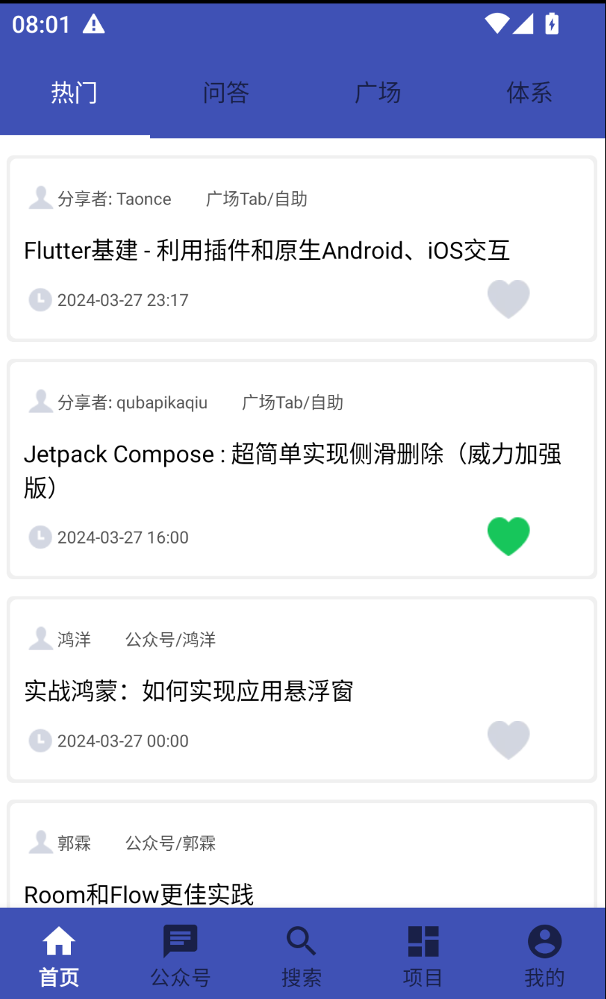
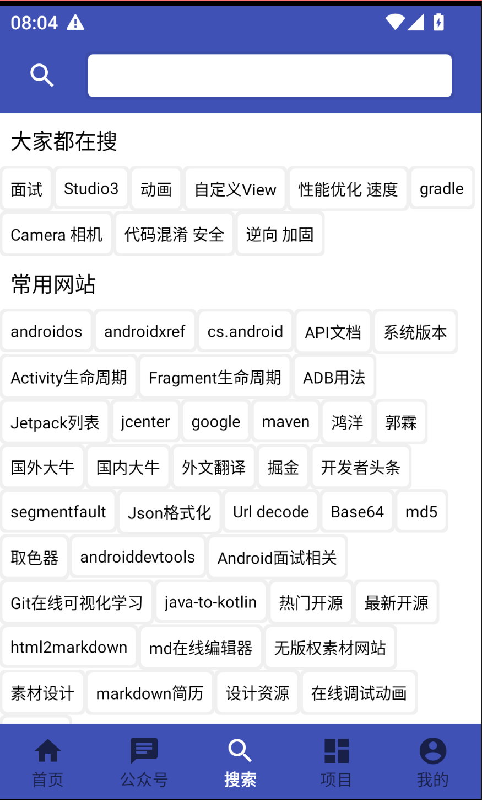
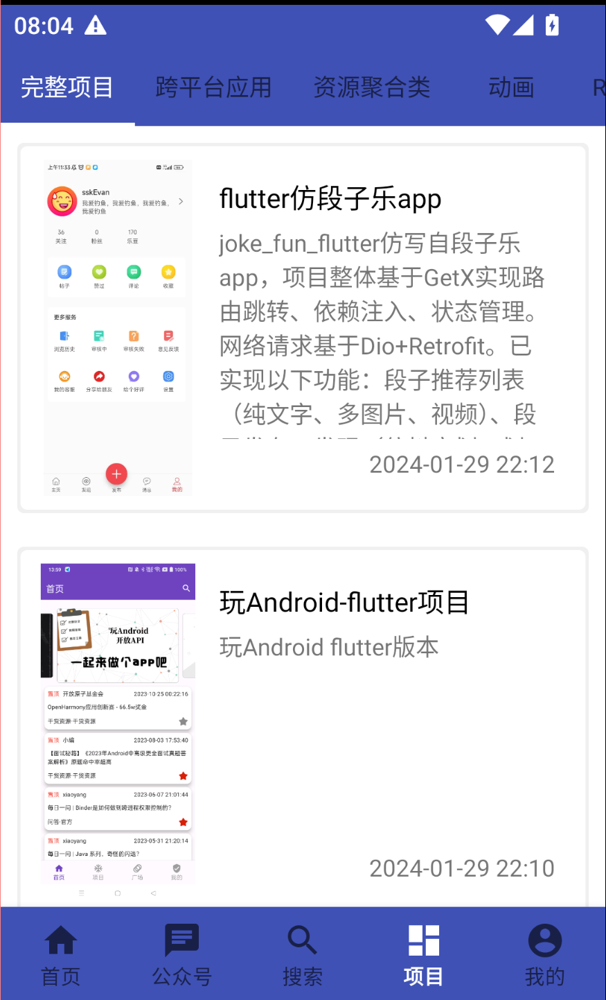
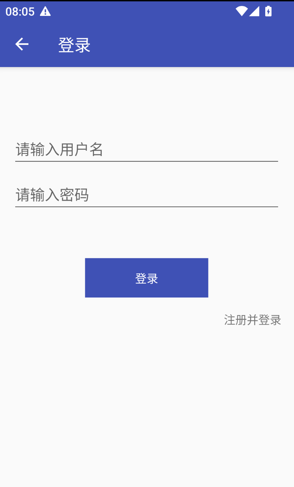
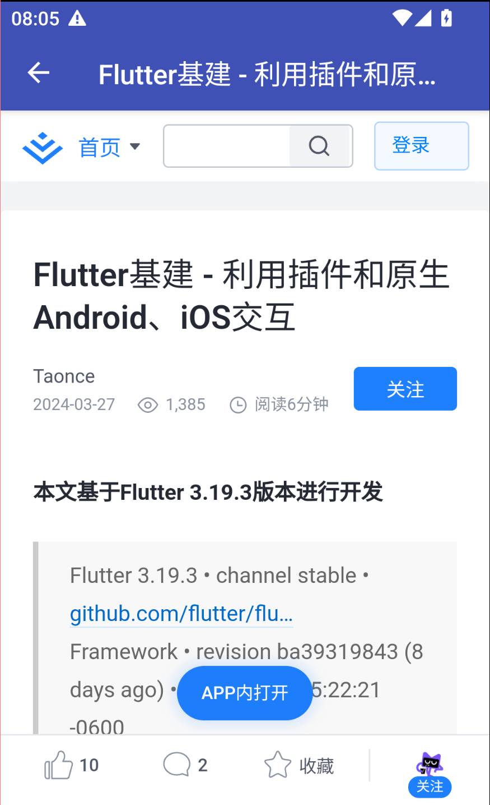

# wanandroid
[Wanandroid](https://www.wanandroid.com/) 是鸿洋鸿大大的安卓开源知识网站，包含最新博文，最新项目，常用工具，公众号文章收录等等功能，同时也开源了所有 API 接口，方便大家打造自己的 Wanandroid 客户端。

项目采用`Kotlin+jatpack mmvm+liveData+协程`的架构
网络使用`okhttp+retrofit`
图片使用`glide`

项目UI和功能参考的另一个[开源项目](https://github.com/lulululbj/wanandroid)

目前1.0功能已实现：

* 各个类型的文章列表
* 热词+常用网站+输入搜索
* 项目展示
* 登录

后续待完成功能：

* 收藏管理
* 历史记录

项目展示：

